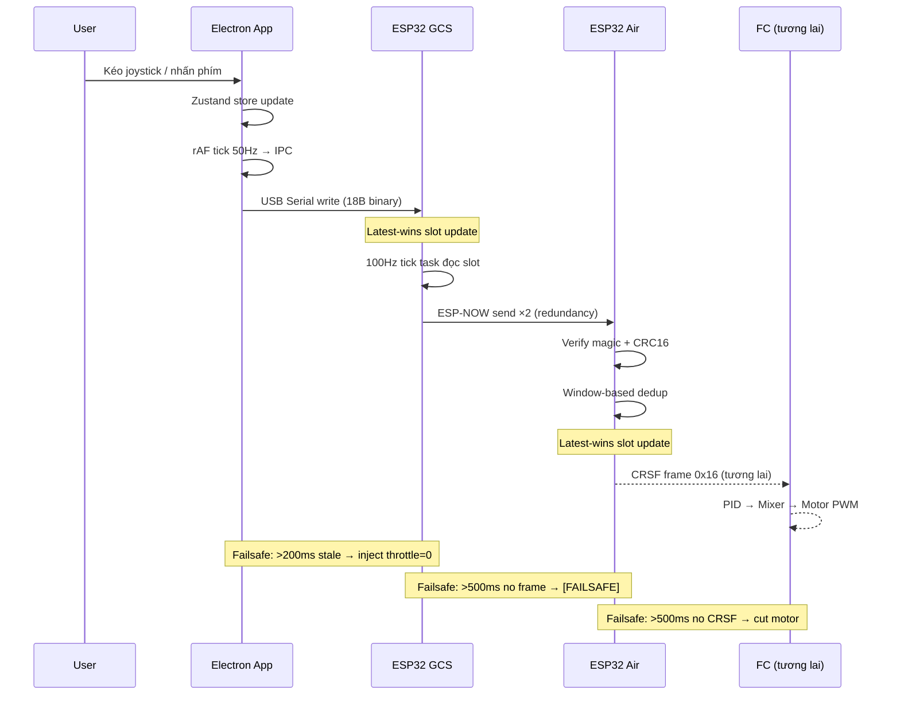
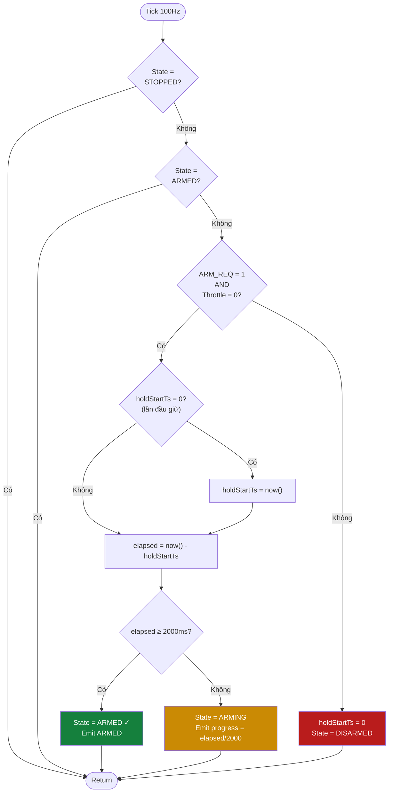
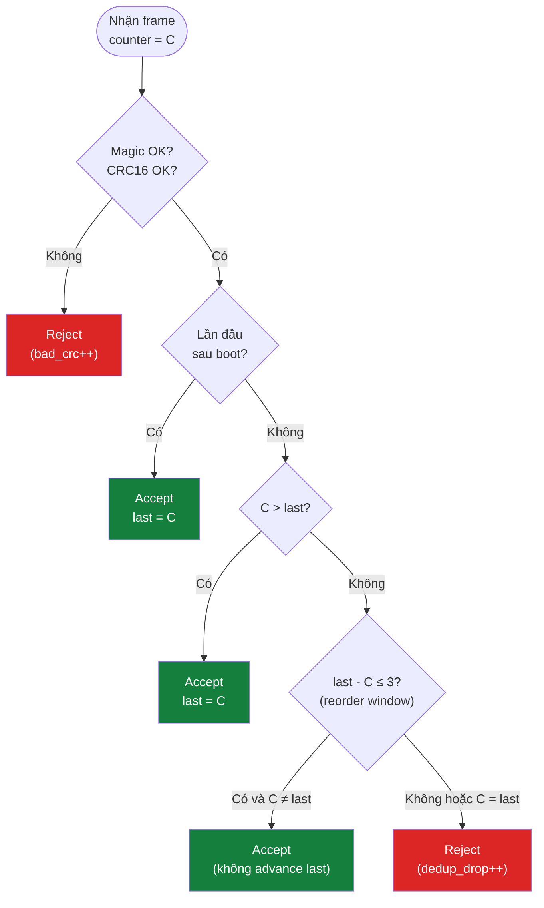

# Tài liệu báo cáo môn học

Tập hợp sơ đồ, bảng biểu, kết luận phục vụ báo cáo môn học. Tất cả sơ đồ
dùng Mermaid — có thể render trên GitHub, hoặc export ra hình PNG qua
[mermaid.live](https://mermaid.live) để chèn Word/LaTeX.

---

## 1. Sơ đồ khối hệ thống

```mermaid
graph LR
    subgraph HOST["Laptop (Host)"]
        APP["Electron App<br/>React + TypeScript"]
    end

    subgraph GCS_NODE["ESP32 #1 (Ground Station)"]
        GCS_USB["USB CDC<br/>Serial Reader"]
        GCS_SLOT["Latest-Wins<br/>Slot"]
        GCS_TICK["100 Hz Tick<br/>Task"]
        GCS_ESPNOW["ESP-NOW TX<br/>1 Mbps LR"]
        GCS_USB --> GCS_SLOT --> GCS_TICK --> GCS_ESPNOW
    end

    subgraph AIR_NODE["ESP32 #2 (Air / Drone)"]
        AIR_ESPNOW["ESP-NOW RX<br/>Callback"]
        AIR_DEDUP["CRC16 +<br/>Dedup"]
        AIR_SLOT["Latest-Wins<br/>Slot"]
        AIR_SERIAL["USB Serial<br/>Debug Print"]
        AIR_CRSF["CRSF UART TX<br/>(tương lai)"]
        AIR_ESPNOW --> AIR_DEDUP --> AIR_SLOT
        AIR_SLOT --> AIR_SERIAL
        AIR_SLOT -.-> AIR_CRSF
    end

    subgraph FC_NODE["Flight Controller (tương lai)"]
        FC_PARSER["CRSF Parser"]
        FC_PID["PID Controller"]
        FC_MIXER["Motor Mixer"]
        FC_MOTOR["4× ESC/Motor"]
        FC_PARSER --> FC_PID --> FC_MIXER --> FC_MOTOR
    end

    APP -- "USB Serial<br/>18B @ 100Hz" --> GCS_USB
    GCS_ESPNOW -- "ESP-NOW 2.4GHz<br/>18B @ 100Hz ×2" --> AIR_ESPNOW
    AIR_CRSF -. "UART 420kbaud<br/>CRSF 0x16" .-> FC_PARSER

    style HOST fill:#1e293b,stroke:#64748b,color:#e2e8f0
    style GCS_NODE fill:#0f172a,stroke:#22c55e,color:#e2e8f0
    style AIR_NODE fill:#0f172a,stroke:#3b82f6,color:#e2e8f0
    style FC_NODE fill:#0f172a,stroke:#f59e0b,color:#e2e8f0,stroke-dasharray: 5 5
```



---

## 2. Sơ đồ luồng dữ liệu (Data Flow)



---

## 3. Flowchart thuật toán ARM



---

## 4. Flowchart chuỗi Failsafe

```mermaid
flowchart TD
    subgraph L1["Tầng 1: App → GCS"]
        A1{"Renderer gửi<br/>stick update?"} -->|">200ms không| B1["Inject failsafe frame<br/>throttle=0, arm=0"]
        A1 -->|Có| C1["Forward frame<br/>bình thường"]
    end

    subgraph L2["Tầng 2: GCS → Air"]
        A2{"Air nhận<br/>ESP-NOW frame?"} -->|">500ms không| B2["Slot stale<br/>Hiện FAILSAFE"]
        A2 -->|Có| C2["Update slot<br/>bình thường"]
    end

    subgraph L3["Tầng 3: Air → FC (tương lai)"]
        A3{"FC nhận<br/>CRSF frame?"} -->|">500ms không| B3["Cắt PWM motor<br/>Disarm"]
        A3 -->|Có| C3["Update setpoints<br/>bình thường"]
    end

    B1 --> A2
    C1 --> A2
    B2 -.-> A3
    C2 -.-> A3

    style B1 fill:#dc2626,color:#fff
    style B2 fill:#dc2626,color:#fff
    style B3 fill:#dc2626,color:#fff
    style L3 stroke-dasharray: 5 5
```

---

## 5. Flowchart thuật toán Dedup (Anti-replay)



---

## 6. Sơ đồ kết nối phần cứng

### 6.1. Tổng quan kết nối

```
┌─────────────────┐          ┌─────────────────┐          ┌─────────────────┐
│    LAPTOP       │   USB    │   ESP32 #1      │  2.4GHz  │   ESP32 #2      │
│                 │ ◄──────► │   GCS           │ ◄──────► │   AIR           │
│  Electron App   │  cable   │   (mặt đất)     │  ESP-NOW │   (trên drone)  │
└─────────────────┘          └─────────────────┘          └────────┬────────┘
                                                                   │ UART
                                                           ┌───────▼────────┐
                                                           │  Flight        │
                                                           │  Controller    │
                                                           │  (tương lai)   │
                                                           └────────────────┘
```

### 6.2. Bảng chân kết nối

| Kết nối | ESP32 Pin | FC Pin | Baud | Ghi chú |
|---|---|---|---|---|
| GCS USB ↔ Laptop | Micro-USB (CP2102) | — | USB speed | Cấp nguồn + data |
| Air USB ↔ Laptop (debug) | Micro-USB (CP2102) | — | 115200 | Chỉ monitor log |
| Air UART TX → FC RX | GPIO17 (TX2) | PA10 (USART1_RX) | 420000 | CRSF data |
| Air UART RX ← FC TX | GPIO16 (RX2) | PA9 (USART1_TX) | 420000 | Telemetry (tương lai) |
| Air GND ↔ FC GND | GND | GND | — | **Bắt buộc** |
| Air nguồn | VIN hoặc USB 5V | — | — | Từ BEC 5V hoặc USB |

### 6.3. Lưu ý phần cứng

- Logic level: cả ESP32 và STM32F411 đều 3.3V → nối trực tiếp, không cần level shifter
- Dây UART: giữ < 15 cm, khuyến khích twisted pair chống nhiễu
- ESP32 Air nên cách ESC/motor/PDB ≥ 5 cm để giảm EMI
- Anten ESP32: PCB ceramic đủ cho bench (< 10 m). Nên dùng u.FL + anten ngoài 3 dBi cho bay thật

---

## 7. Bảng so sánh giải pháp

| Đặc tính | **drone-ctrl** (project này) | **ExpressLRS** | **TBS Crossfire** | **DJI OcuSync** | **WiFi Direct** |
|---|---|---|---|---|---|
| **Kiến trúc** | App → ESP32 ×2 → FC | TX module → RX module → FC | TX → RX → FC | TX → RX → FC | Phone → FC |
| **Tần số** | 2.4 GHz (ESP-NOW) | 2.4 / 900 MHz | 900 MHz | 2.4 / 5.8 GHz | 2.4 / 5 GHz |
| **Giao thức RF** | ESP-NOW (802.11) | LoRa / FLRC | LoRa | Proprietary | WiFi |
| **FHSS** | ❌ Fixed channel | ✅ 80+ channels | ✅ | ✅ | ❌ |
| **Mã hóa** | ❌ (tech debt) | ❌ (binding phrase) | ❌ | ✅ AES-128 | ✅ WPA2/3 |
| **Latency** | ~18 ms (p50) | 2–5 ms | 4–8 ms | ~30 ms | 50–200 ms |
| **Update rate** | 100 Hz | 50–500 Hz | 150 Hz | 50 Hz | 10–50 Hz |
| **Range** | ~50 m (1M_L, PCB ant) | 5–100+ km | 5–40 km | 5–15 km | 50–200 m |
| **Failsafe** | 3 tầng timeout | ✅ Built-in | ✅ Built-in | ✅ Built-in | ❌ Thường không |
| **Anti-replay** | uint32 counter | Sequence + binding | Sequence | Session key | N/A |
| **Giá thành (USD)** | ~$6 (2× ESP32) | $15–40 (TX+RX) | $80–150 | $200+ | $0 (có sẵn) |
| **Độ phức tạp** | Tự build from scratch | Flash firmware có sẵn | Plug & play | Plug & play | Tự build |
| **Customizable** | ✅ Full source code | ✅ Open source | ❌ Closed | ❌ Closed | ✅ |
| **Yêu cầu app** | ✅ Desktop app kèm | Cần TX radio riêng | Cần TX radio riêng | Cần DJI remote | Tùy |

### Nhận xét

- **drone-ctrl** phù hợp cho **nghiên cứu, học tập, prototyping** — chi phí thấp, tùy biến cao, hiểu rõ nguyên lý.
- **ELRS** là lựa chọn tốt nhất cho **bay thật** — latency thấp, range xa, open source, community lớn.
- **DJI** cho **sản phẩm thương mại** — mã hóa, ổn định, nhưng đóng kín.
- **WiFi Direct** — latency cao, không failsafe chuẩn → **không phù hợp** cho drone.

---

## 8. Kết quả đạt được

### 8.1. Phần mềm

| Thành phần | Ngôn ngữ | LOC | Trạng thái |
|---|---|---|---|
| Wire protocol (C + Python + TypeScript) | C, Python, TS | ~500 | ✅ Hoàn thành, cross-verified |
| ESP32 GCS firmware | C++ (Arduino) | ~400 | ✅ Hoàn thành |
| ESP32 Air firmware | C++ (Arduino) | ~350 | ✅ Hoàn thành |
| Electron desktop app | TypeScript, React | ~1800 | ✅ Hoàn thành |
| Benchmark tool | Python | ~250 | ✅ Hoàn thành |
| **Tổng** | | **~3300** | |

### 8.2. Hiệu năng đo được

| Chỉ số | Mục tiêu | Kết quả thực tế |
|---|---|---|
| Packet loss | < 0.5% | **0.00%** (3001/3001 frames) |
| Latency p50 | < 15 ms | **18 ms** (bao gồm serial overhead) |
| Latency p99 | < 25 ms | **24 ms** |
| Update rate | 100 Hz | **100 Hz** ổn định |
| Failsafe response | < 500 ms | **200 ms** (tầng 1) |
| Sustained operation | > 30 s | **30 s** không crash |

### 8.3. Kiểm thử

- 21 unit tests (protocol CRC16 + telemetry parser) — **100% pass**
- Byte-level cross-verification C ↔ Python ↔ TypeScript — **khớp hoàn toàn**
- Hardware integration test trên 2× ESP32 thật — **link ổn định**
- Electron app manual UI test — **tất cả controls hoạt động**

---

## 9. Kết luận

### 9.1. Thành quả

Đề tài đã xây dựng thành công hệ thống điều khiển drone không dây từ desktop
app tới module gắn trên drone, sử dụng 2 ESP32 giao tiếp qua ESP-NOW. Hệ
thống đạt **0% mất gói ở 100 Hz** trong 30 giây benchmark liên tục, với
latency p99 ~24 ms — đủ cho điều khiển drone thời gian thực.

Desktop app cung cấp giao diện trực quan với virtual joystick, throttle
slider, cơ chế ARM an toàn (hold-to-arm 2 giây), nút STOP khẩn cấp, và
Link HUD hiển thị trạng thái kết nối real-time.

### 9.2. Hạn chế

1. **Chưa mã hóa RF** — ESP-NOW encryption gặp bug silently drop frames trên
   Arduino-ESP32 core 3.3.7. Dữ liệu stick truyền plaintext.
2. **Chưa có CRSF output** — Air module hiện chỉ in debug ra USB serial,
   chưa encode CRSF để nối FC.
3. **Range hạn chế** — ~50 m do LR mode không support trên chip ESP32-D0WD-V3,
   phải dùng 1 Mbps Long Preamble.
4. **Không có FHSS** — channel cố định (6), dễ bị nhiễu WiFi.
5. **Latency đo lường bị ô nhiễm** — con số 18–24 ms bao gồm ~5–15 ms
   buffering USB-CDC, latency RF thực ~5–10 ms nhưng chưa đo trực tiếp.

### 9.3. Hướng phát triển

1. **Kết nối Air → FC**: encode CRSF frame từ Air UART TX, viết CRSF parser
   phía FC, nối vật lý 2 dây UART.
2. **Bật ESP-NOW encryption**: debug root cause bug drop frame, hoặc implement
   app-layer AES-CCM.
3. **Thêm telemetry ngược**: FC gửi battery + attitude qua CRSF → Air →
   GCS → App để hiển thị artificial horizon.
4. **Tăng range**: chuyển sang ESP32-S3 (support LR mode) hoặc thêm anten
   ngoài u.FL.
5. **FHSS**: implement channel hopping đồng bộ giữa GCS và Air để chống
   nhiễu.

---

## 10. Tài liệu tham khảo

1. Espressif Systems, "ESP-NOW User Guide", ESP-IDF Programming Guide,
   https://docs.espressif.com/projects/esp-idf/en/latest/esp32/api-reference/network/esp_now.html

2. Team BlackSheep, "CRSF Protocol Specification (Crossfire)",
   https://github.com/crsf-wg/crsf/wiki

3. ExpressLRS Community, "ExpressLRS Documentation",
   https://www.expresslrs.org/

4. Electron.js Documentation, https://www.electronjs.org/docs/latest

5. Arduino-ESP32 Core, Espressif,
   https://github.com/espressif/arduino-esp32

6. React Documentation, https://react.dev/

7. Zustand State Management, https://github.com/pmndrs/zustand

8. Node SerialPort, https://serialport.io/

9. CRC-16/CCITT Algorithm, "Cyclic Redundancy Check",
   https://en.wikipedia.org/wiki/Cyclic_redundancy_check

10. IEEE 802.11 Standard, "Wireless LAN Medium Access Control",
    https://standards.ieee.org/standard/802_11-2020.html
