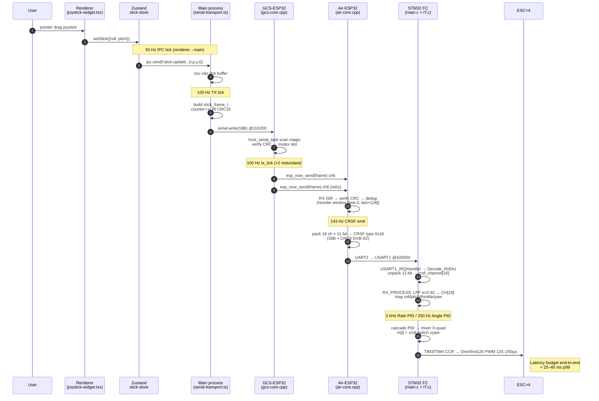
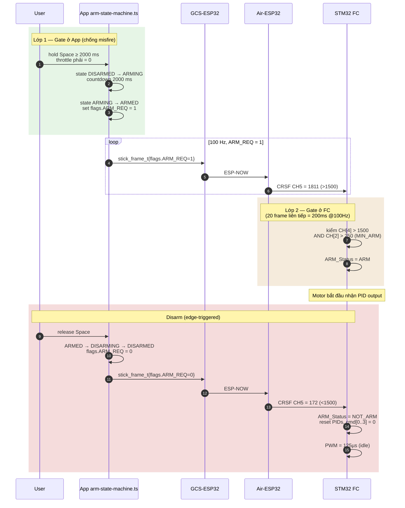
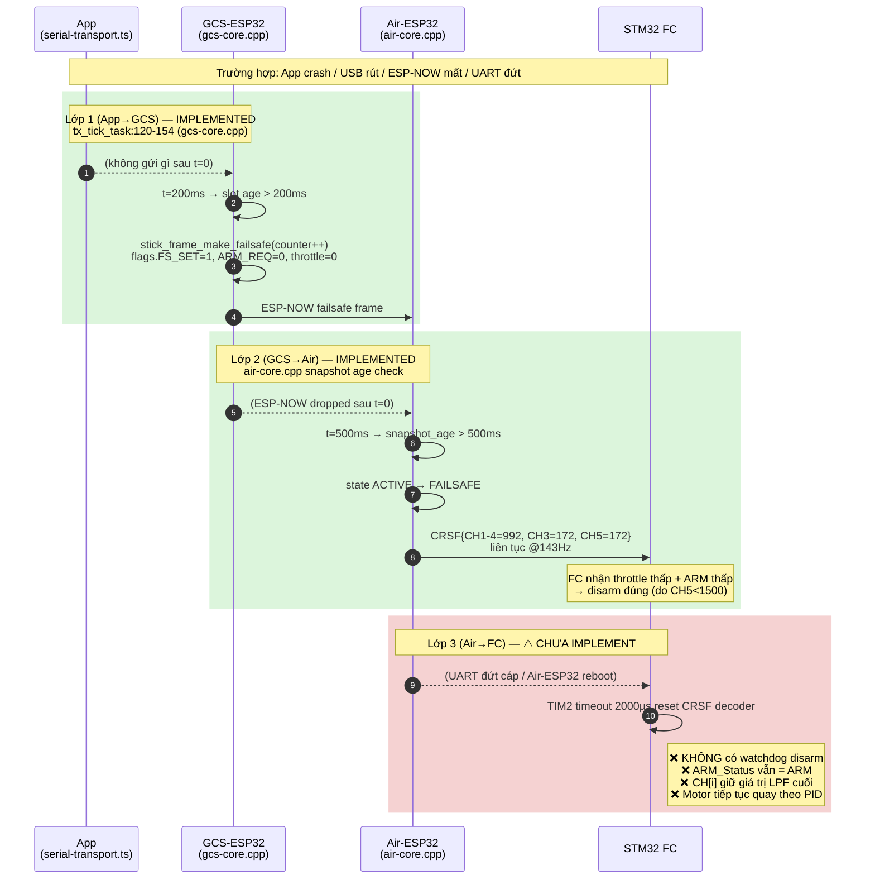

# Luồng điều khiển End-to-End: App → GCS → Air → STM32

**Ngày:** 2026-05-05  
**Phạm vi:** F411_FC4 (STM32 firmware) + drone-ctrl (app-electron, gcs-esp32, air-esp32)  
**Trạng thái hệ thống:** đã armed + spin motor ở bench, chưa bay tự do.

---

## 1. Tóm tắt

Hệ thống gồm **4 hop**, dùng cùng một frame 18 byte `stick_frame_t` từ App tới Air-ESP32, sau đó Air-ESP32 chuyển sang **CRSF** để nói chuyện với STM32 FC. Một stick frame mang RPY (±1000), throttle (0–2000), 4 flags (ARM_REQ / MODE / FS_SET), monotonic counter chống replay, và CRC-16/CCITT.

```
[Electron App]──USB-CDC 115200──[GCS-ESP32]──ESP-NOW ch6 1M_L──[Air-ESP32]──CRSF UART2 420000──[STM32 F411]──OneShot125 PWM 1.92kHz──[ESC×4]
   100Hz TX                       100Hz TX ×2 redundant            143Hz CRSF                     PID Rate 2kHz / Angle 250Hz
```

---

## 2. 4 Hop ở dạng bảng

| # | Hop | Input | Processing | Output | Rate | Failsafe |
|---|-----|-------|------------|--------|------|----------|
| 1 | App → GCS | Joystick SVG / WASD keyboard → Zustand `stick-store` | 50 Hz IPC tick gom state → main process buffer slot → 100 Hz TX tick build `stick_frame_t`, gắn counter, fill CRC | 18 byte qua `serialport @115200 8N1` | **100 Hz** | Main `tx_tick` tự gen failsafe nếu IPC slot stale > 200 ms |
| 2 | GCS → Air | USB-CDC byte stream | `host_serial_task` quét magic `0xC3 0xA5` → đọc 16 byte tiếp → verify CRC → ghi mutex slot | `esp_now_send()` gửi nguyên frame tới Air MAC, **gửi 2 lần/tick** redundancy | **100 Hz** | `tx_tick_task` gọi `stick_frame_make_failsafe()` nếu slot age > 200 ms |
| 3 | Air → FC | ESP-NOW RX callback ISR | Verify magic+CRC → dedup window `[last-3, last+128]` (anti-replay) → snapshot mutex | `air_crsf_encoder` pack 16 channels (11-bit LSB) → 26 byte CRSF frame (addr/len/type=0x16/data/CRC8 DVB-S2) qua `UART2 @420000` | **143 Hz** (≈7 ms) | Snapshot age > 500 ms → gửi failsafe CRSF (sticks 992, throttle 172, ARM 172) |
| 4 | FC | USART1 RX ISR | `Decode_RxElrs` (stm32f4xx_it.c:102–200) parse CRSF, unpack 11-bit → `crsf_channel[16]` → LPF α=0.92 → `CH[18]` | Cascade PID (Angle 250 Hz / Rate 2 kHz) → mixer X-quad → `OneShot125` PWM TIM3/TIM4 | **2 kHz** rate loop | ⚠️ **CHƯA CÓ** auto-disarm khi mất CRSF |

---

## 3. Anatomy của stick_frame_t (18 byte, little-endian, packed)

```
Offset  Size  Field      Range / Note
------  ----  --------   ----------------------------------
[0..1]   2    magic      0xA5C3
[2]      1    type       0x01 STICK | 0x20 TELEM | 0x7F ACK
[3]      1    flags      bit0=ARM_REQ  bit1-2=MODE  bit3=FS_SET
[4..7]   4    counter    uint32 monotonic (anti-replay)
[8..9]   2    roll       int16  [-1000..+1000]
[10..11] 2    pitch      int16  [-1000..+1000]
[12..13] 2    yaw        int16  [-1000..+1000]
[14..15] 2    throttle   uint16 [0..2000]
[16..17] 2    crc16      CRC-16/CCITT (poly 0x1021, init 0xFFFF) over [0..15]
```

CRC + verify implementation: `shared/drone-link-protocol.h:89–112`.

---

## 4. Channel mapping

| App field | Wire frame | CRSF channel | STM32 `CH[i]` | Dùng làm |
|-----------|-----------|--------------|---------------|----------|
| `roll`    ±1000 | `roll`    int16  | CH1 (idx 0) 11-bit | `CH[0]` | Roll setpoint ±90° (HOVER) hoặc rate (RATE) |
| `pitch`   ±1000 | `pitch`   int16  | CH2 (idx 1) | `CH[1]` | Pitch setpoint |
| `throttle` 0–2000 | `throttle` uint16 | CH3 (idx 2) | `CH[2]` | Throttle 0–100%, ngưỡng arm `MIN_ARM=250` |
| `yaw`     ±1000 | `yaw`     int16  | CH4 (idx 3) | `CH[3]` | Yaw rate ±90°/s |
| `flags.ARM_REQ` | `flags`   bit0  | CH5 (idx 4) binary | `CH[4]` | Arm switch (>1500 = arm) |
| `flags.MODE` | `flags`   bit1-2 | CH6 (idx 5) | `CH[5]` | >800 = HOVER, <800 = RATE |
| – | – | CH7-CH10 | `CH[6..9]` | PID tuning selectors (centered) |
| `flags.FS_SET` | `flags`   bit3 | (ngầm: throttle 172 + sticks 992) | – | Failsafe marker, FC nhận biết qua giá trị thấp |

---

## 5. Sequence Diagram — Happy Path (di chuyển stick → motor quay)



---

## 6. Sequence Diagram — Arm / Disarm (2 lớp gate)



**File refs:**  
- App gate 2000ms: `app-electron/src/main/arm-state-machine.ts:38–82`  
- FC arm condition: `Core/Src/main.c:644`  
- FC disarm action: `Core/Src/main.c:645–651`

---

## 7. Sequence Diagram — Failsafe 3 lớp (lớp 4 đang THIẾU)



**Risk khi đã armed mà UART Air→FC đứt:**  
Drone không tự cắt motor. Phải thêm watchdog ở `RX_PROCESS` (`Core/Src/main.c`) hoặc trong `USART1_IRQHandler`: nếu không có frame CRSF hợp lệ trong N ms (ví dụ 500 ms), force `ARM_Status = NOT_ARM` và `cmd[0..3] = 0`.

---

## 8. Tóm tắt File:Line tham chiếu

### App Electron
- TX tick 100 Hz: `app-electron/src/main/serial-transport.ts:171–196`
- Arm state machine: `app-electron/src/main/arm-state-machine.ts:38–82`
- Joystick UI: `app-electron/src/renderer/.../joystick-widget.tsx:44–70`
- Keyboard 50 Hz decay: `app-electron/src/renderer/.../keyboard-listener.tsx:49–85`

### GCS-ESP32
- USB reader: `drone-ctrl/gcs-esp32/gcs-core.cpp:69–116`
- TX tick + failsafe: `drone-ctrl/gcs-esp32/gcs-core.cpp:120–154`
- Stats 1 Hz: `drone-ctrl/gcs-esp32/gcs-core.cpp:158–173`
- ESP-NOW init: `drone-ctrl/gcs-esp32/gcs-core.cpp:185–219`

### Air-ESP32
- ESP-NOW RX + dedup: `drone-ctrl/air-esp32/air-core.cpp` (rx callback)
- CRSF encoder pack 11-bit: `drone-ctrl/air-esp32/air-crsf-encoder.cpp`
- CRSF UART TX: `drone-ctrl/air-esp32/air-crsf-tx.cpp` (UART2, GPIO17 TX, 420000 baud)
- Failsafe values: sticks 992, throttle 172, ARM 172 (CRSF spec)

### STM32 F411
- Main loop: `Core/Src/main.c:412–416` (IMU_PROCESS → RX_PROCESS → MPC)
- CRSF decoder: `Core/Src/stm32f4xx_it.c:102–200` (Decode_RxElrs)
- USART1 ISR: `Core/Src/stm32f4xx_it.c:399–484`
- RX_PROCESS map channels: `Core/Src/main.c:636–683`
- Arm gate: `Core/Src/main.c:644`
- Disarm action: `Core/Src/main.c:645–651`
- Mixer X-quad: `Core/Src/main.c:527–534`
- OneShot125 output: `Core/Src/main.c:565–575`

### Shared protocol
- `drone-ctrl/shared/drone-link-protocol.h` — 18-byte struct, CRC16, dedup helper, failsafe constructor

---

## 9. Cảnh báo & gap chưa đóng (chỉ liệt kê, không expand)

1. **STM32 thiếu watchdog CRSF** — risk cao khi bench → flight, nhất là sau `disarm-rearm-bug-fix` plan đang tiến hành.
2. **Telemetry uplink** — link hiện 1 chiều. App chỉ thấy stats GCS local, không có RPY/battery/RSSI từ FC.
3. **Magnetometer chưa fuse** — yaw drift theo thời gian (ARHS chỉ gyro+accel).
4. **IMU calibration không persist** — load hardcoded mỗi lần boot.
5. **No RSSI/CRC failure counter** ở CRSF decoder → khó debug link quality từ FC.

---

## 10. Câu hỏi chưa giải quyết

1. **OneShot125 timing**: TIM3/TIM4 đang chạy 1.92 kHz, ESC có happy với edge resolution này không?
2. **IMU sample rate thực tế**: Code mention 600 µs nhưng `dt` hardcode 625 µs trong PID — cần đo bằng `LL_TIM_GetCounter(TIM2)` để xác nhận.
3. **Counter sync App↔GCS**: Khi App restart, counter reset về 0 trong khi GCS vẫn nhớ counter cũ — dedup logic có reject burst đầu tiên không?
4. **Encryption ESP-NOW**: hiện đang disabled (DEBUG mode). Khi production, dùng PMK/LMK nào, key management ra sao?
5. **BENCH_MODE throttle cap**: có config nào giới hạn throttle max ở bench (ví dụ 30%) không? Hiện code không thấy clamp.
