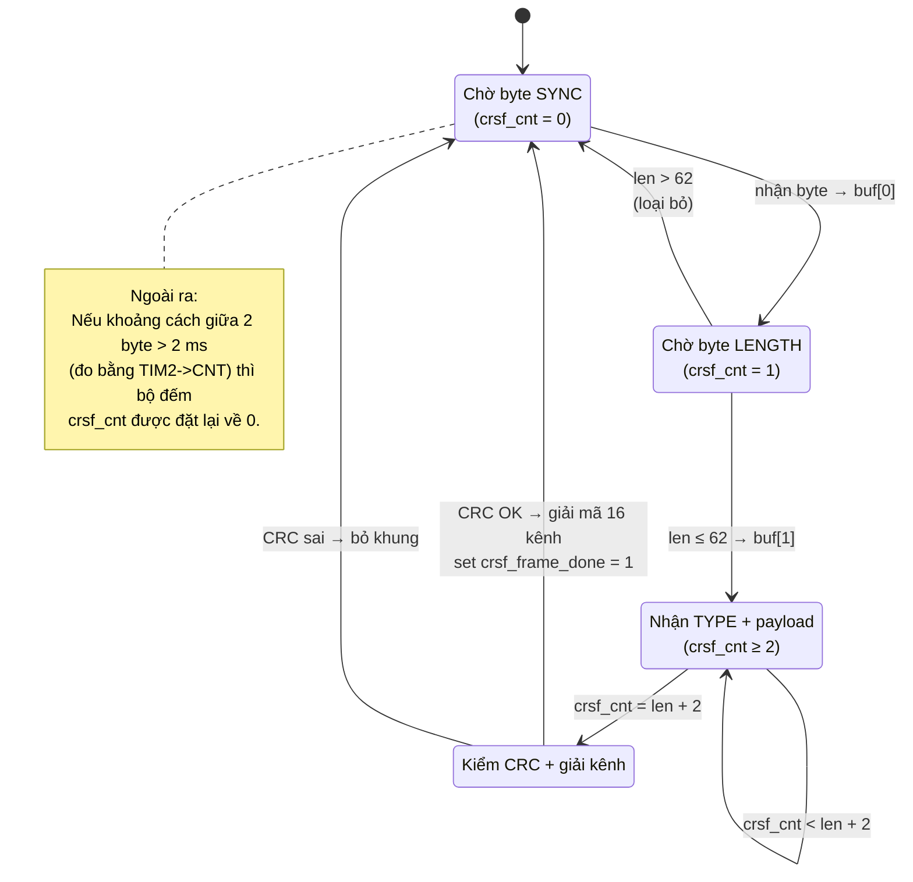
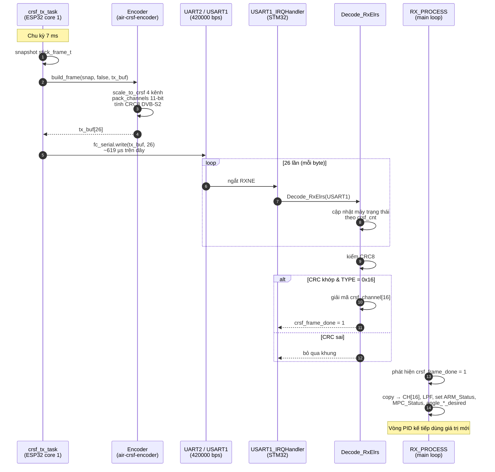

# Báo cáo Giao tiếp giữa Module ESP32 Air và Vi điều khiển STM32F411 trên Drone

**Sinh viên:** quanganh208  
**Ngày:** 2026-05-05  
**Phạm vi:** Mô tả chi tiết kênh truyền dữ liệu RC từ module thu sóng ESP32 Air đến vi điều khiển trung tâm STM32F411 sử dụng giao thức CRSF qua UART.

---

## 1. Giới thiệu

Trong kiến trúc tổng thể của hệ thống điều khiển drone, mạch ESP32 Air đóng vai trò là **đầu cuối thu sóng** (Air-side receiver) cho liên kết vô tuyến ESP-NOW, còn vi điều khiển STM32F411CEU6 đóng vai trò **flight controller** (FC) thực thi vòng lặp điều khiển PID và sinh tín hiệu PWM ra bốn động cơ. Hai vi xử lý này nằm trên cùng một bo mạch và trao đổi dữ liệu qua giao tiếp UART nối tiếp theo chuẩn **CRSF (Crossfire Serial Protocol)** — một chuẩn truyền dữ liệu RC tốc độ cao do TBS Crossfire / ExpressLRS sử dụng.

Báo cáo này trình bày chi tiết các khía cạnh sau:

1. Sơ đồ kết nối phần cứng giữa hai vi xử lý.
2. Tham số cấu hình UART ở cả hai phía.
3. Cấu trúc khung dữ liệu CRSF kiểu `RC_CHANNELS_PACKED`.
4. Cơ chế phát khung từ phía ESP32 Air.
5. Cơ chế thu và giải mã khung từ phía STM32.
6. Phân tích thời gian truyền và tải bus.

---

## 2. Sơ đồ kết nối phần cứng

ESP32-WROOM-32 và STM32F411CEU6 đều hoạt động ở mức logic 3.3 V, do đó hai chân UART được kết nối trực tiếp không qua mạch chuyển mức.

```
   ESP32 Air                          STM32F411
 ┌────────────┐                     ┌────────────┐
 │  GPIO17    │ ───────────────────►│ PA10        │
 │  (UART2 TX)│   CRSF data 420 kbps│ (USART1 RX) │
 │            │                     │             │
 │  GPIO16    │ ◄───── (dự phòng) ──│ PA9         │
 │  (UART2 RX)│   chưa sử dụng      │ (USART1 TX) │
 │            │                     │             │
 │   GND      │ ────────────────────│ GND         │
 └────────────┘                     └────────────┘
```

**Bảng kết nối:**

| Tín hiệu | ESP32 Air | STM32F411 | Chiều truyền | Trạng thái |
|----------|-----------|-----------|--------------|------------|
| Dữ liệu RC | GPIO17 (TX) | PA10 (RX) | Air → FC | Đang dùng |
| Telemetry | GPIO16 (RX) | PA9 (TX) | FC → Air | Dự phòng (chưa sử dụng) |
| Mass chung | GND | GND | — | Bắt buộc |

Chiều truyền hiện tại là **một chiều** từ Air sang FC. Đường ngược lại từ FC về Air đã được bố trí phần cứng nhưng chưa được kích hoạt phần mềm — để dành cho tính năng telemetry trong phiên bản tương lai.

---

## 3. Tham số UART hai phía

Cả hai phía cấu hình UART hoàn toàn đối xứng để khớp về tốc độ và định dạng khung.

| Tham số | Giá trị | Ghi chú |
|---------|---------|---------|
| Tốc độ baud | **420 000 bps** | Chuẩn CRSF bắt buộc |
| Số bit dữ liệu | 8 | |
| Bit chẵn lẻ | None | |
| Bit dừng | 1 | |
| Điều khiển luồng | None | |
| Định dạng (chuẩn) | **8N1** | |

**Phía ESP32 Air** (`drone-ctrl/air-esp32/air-crsf-tx.cpp:48`):

```cpp
fc_serial.begin(FC_BAUD, SERIAL_8N1, FC_RX_PIN, FC_TX_PIN);
// FC_BAUD = 420000, FC_TX_PIN = 17, FC_RX_PIN = 16
```

Đối tượng `HardwareSerial(2)` ánh xạ tới UART2 của ESP32 với chân TX/RX được remap qua matrix nội bộ.

**Phía STM32F411** (`Core/Src/usart.c:63–70`):

```c
USART_InitStruct.BaudRate = 420000;
USART_InitStruct.DataWidth = LL_USART_DATAWIDTH_8B;
USART_InitStruct.StopBits  = LL_USART_STOPBITS_1;
USART_InitStruct.Parity    = LL_USART_PARITY_NONE;
USART_InitStruct.OverSampling = LL_USART_OVERSAMPLING_16;
LL_USART_Init(USART1, &USART_InitStruct);
```

Ngắt nhận `USART1_IRQn` được kích hoạt với mức ưu tiên (3, 0):

```c
NVIC_SetPriority(USART1_IRQn,
    NVIC_EncodePriority(NVIC_GetPriorityGrouping(), 3, 0));
NVIC_EnableIRQ(USART1_IRQn);
```

---

## 4. Cấu trúc khung CRSF (RC_CHANNELS_PACKED)

Mỗi khung dữ liệu CRSF chứa 16 kênh điều khiển, mỗi kênh được mã hóa 11 bit (tương đương phân giải 2048 mức) và xếp liên tiếp theo thứ tự bit thấp trước.

### 4.1. Layout chi tiết 26 byte

```
Byte index │ Tên trường       │ Giá trị / Ý nghĩa
───────────┼──────────────────┼────────────────────────────────────
[0]        │ SYNC             │ 0xC8  (CRSF_ADDRESS_FLIGHT_CONTROLLER)
[1]        │ LENGTH           │ 0x18  (24 byte tiếp theo, gồm
           │                  │        TYPE + 22 payload + CRC)
[2]        │ TYPE             │ 0x16  (RC_CHANNELS_PACKED)
[3]…[24]   │ PAYLOAD          │ 22 byte = 16 kênh × 11 bit
           │                  │ đóng gói LSB-first
[25]       │ CRC8 DVB-S2      │ Tính trên byte [2]…[24]
                                (đa thức 0xD5, init 0x00)
```

Tổng độ dài: **26 byte** không đổi cho mọi khung loại RC.

### 4.2. Quy tắc đóng gói 11 bit liên tục

Mỗi kênh giá trị `c[i]` (11 bit) được ghép nối tiếp vào dòng bit chung. Vì 11 không phải bội số của 8, mỗi kênh có thể trải trên 2 hoặc 3 byte liên tiếp. Mã đóng gói trên ESP32 (`air-crsf-encoder.cpp:22-38`):

```cpp
for (int i = 0; i < 16; i++) {
  uint32_t bit_pos  = 11 * i;
  uint32_t byte_idx = bit_pos / 8;
  uint32_t bit_off  = bit_pos % 8;
  uint16_t value    = ch[i] & 0x07FF;

  out[byte_idx]     |= value << bit_off;
  out[byte_idx + 1] |= value >> (8 - bit_off);
  if (bit_off > 5) {
    out[byte_idx + 2] |= value >> (16 - bit_off);
  }
}
```

Phía STM32 thực hiện thao tác giải gói nghịch đảo bằng các phép dịch bit và toán tử bitwise OR cho từng kênh, ví dụ kênh 0 và kênh 1 (`stm32f4xx_it.c:152-153`):

```c
crsf_channel[0] = ((p[0]      | p[1] << 8)            ) & 0x07FF;
crsf_channel[1] = ((p[1] >> 3 | p[2] << 5)            ) & 0x07FF;
```

Kết quả là một mảng `crsf_channel[16]` chứa giá trị 11-bit `[0…2047]` cho 16 kênh.

### 4.3. CRC8 DVB-S2

Mã kiểm tra dùng đa thức **0xD5** (chuẩn DVB-S2), giá trị khởi tạo 0x00, không phản chuyển bit, không XOR cuối:

```c
static uint8_t crsf_crc8(uint8_t crc, uint8_t data) {
  crc ^= data;
  for (int i = 0; i < 8; i++) {
    if (crc & 0x80) crc = (crc << 1) ^ 0xD5;
    else            crc = (crc << 1);
  }
  return crc;
}
```

CRC được tính trên các byte từ TYPE (`buf[2]`) đến hết PAYLOAD (`buf[24]`) — tổng cộng 23 byte. Hai phía phát/thu dùng đúng cùng một hàm để đảm bảo so khớp.

### 4.4. Quy ước biên giá trị kênh (CRSF channel)

| Hằng số | Giá trị 11-bit | Ý nghĩa |
|---------|----------------|---------|
| `CRSF_CH_MIN` | 172  | Cực tiểu, ứng với cần điều khiển ở vị trí thấp nhất |
| `CRSF_CH_MID` | 992  | Trung điểm, tay ga thả lỏng |
| `CRSF_CH_MAX` | 1811 | Cực đại |

---

## 5. Phía phát: ESP32 Air

### 5.1. Task FreeRTOS gửi định kỳ 143 Hz

Hàm `crsf_tx_task` (`air-crsf-tx.cpp:21-45`) chạy như một tác vụ FreeRTOS độc lập, được ghim vào nhân CPU số 1 với mức ưu tiên 5 và stack 4096 byte:

```cpp
xTaskCreatePinnedToCore(crsf_tx_task, "air_crsf",
                        4096, nullptr, 5, nullptr, 1);
```

Vòng lặp chính dùng `vTaskDelayUntil` để giữ chu kỳ chính xác 7 ms (xấp xỉ **143 Hz**):

```cpp
const TickType_t period = pdMS_TO_TICKS(7);  // ≈143 Hz
TickType_t next = xTaskGetTickCount();
for (;;) {
    // 1) Lấy snapshot dữ liệu RC mới nhất từ link ESP-NOW
    stick_frame_t snap; uint64_t age_us;
    bool has = air_core::snapshot(&snap, &age_us);

    // 2) Quyết định gửi khung bình thường hay khung failsafe
    bool fs = !has || age_us > 500000ULL;

    // 3) Đóng khung CRSF 26 byte
    air_crsf::build_frame(has ? &snap : nullptr, fs, tx_buf);

    // 4) Phát qua UART
    fc_serial.write(tx_buf, 26);

    vTaskDelayUntil(&next, period);
}
```

### 5.2. Ánh xạ giá trị cần điều khiển sang giá trị kênh CRSF

Hàm `scale_to_crsf` (`air-crsf-encoder.cpp:11-18`) ánh xạ tuyến tính từ dải đầu vào của `stick_frame_t` sang dải [172…1811] với phép làm tròn đối xứng:

```cpp
return CRSF_CH_MIN + ((value - in_min) * 1639 + span/2) / span;
```

| Trường gốc | Dải đầu vào | Kênh CRSF | Dải đầu ra |
|------------|-------------|-----------|------------|
| `roll`     | −1000 … +1000 | CH1 (idx 0) | 172 … 1811 |
| `pitch`    | −1000 … +1000 | CH2 (idx 1) | 172 … 1811 |
| `throttle` |     0 … +2000 | CH3 (idx 2) | 172 … 1811 |
| `yaw`      | −1000 … +1000 | CH4 (idx 3) | 172 … 1811 |
| `flags.ARM_REQ` | bit 0 | CH5 (idx 4) | 1811 nếu set, 172 nếu clear |
| (cố định) | — | CH6 … CH16 | 992 (mid) |

### 5.3. Khung failsafe

Khi liên kết vô tuyến từ GCS bị mất quá 500 ms, ESP32 Air tự động sinh khung failsafe có nội dung như sau (`air-crsf-encoder.cpp:60-63`):

```cpp
ch[0] = ch[1] = ch[3] = 992;   // roll, pitch, yaw đặt giữa
ch[2] = 172;                   // throttle ở mức tối thiểu
ch[4] = 172;                   // ARM ở trạng thái không kích hoạt
```

Khi STM32 nhận khung này, do `CH[4] < 1500` nên trạng thái sẽ chuyển về `NOT_ARM`, các giá trị PID được reset và xung PWM ra động cơ về mức tối thiểu.

---

## 6. Phía thu: STM32F411

### 6.1. Ngắt USART1 và lời gọi giải mã

Ngắt nhận `USART1_IRQHandler` (`Core/Src/stm32f4xx_it.c:399`) gọi hàm `Decode_RxElrs(USART1)` mỗi khi cờ `RXNE` được kích hoạt:

```c
void USART1_IRQHandler(void) {
    Decode_RxElrs(USART1);
}
```

### 6.2. Máy trạng thái phân tích khung từng byte

Bộ giải mã trong `Decode_RxElrs` (`stm32f4xx_it.c:102-200`) hoạt động dưới dạng máy trạng thái byte-by-byte. Cờ `crsf_cnt` đếm byte đã nhận trong khung hiện tại; bộ đệm `crsf_buf[]` lưu byte thô.



Cơ chế timeout 2 ms được hiện thực bằng cách đọc bộ đếm TIM2 (1 MHz) ngay đầu mỗi lần ngắt:

```c
if ((TIM2->CNT - crsf_last_time) > 2000) {
    crsf_cnt = 0;          // reset máy trạng thái
}
crsf_last_time = TIM2->CNT;
```

Sau khi nhận đủ `len + 2` byte, hàm tính lại CRC8 trên vùng [TYPE…payload] và so sánh với byte CRC nhận được. Nếu khớp và `TYPE == 0x16`, 16 phép dịch bit được thực hiện để tách `crsf_channel[0..15]`, sau đó cờ `crsf_frame_done` được đặt lên 1 để báo hiệu cho main loop.

### 6.3. Tiêu thụ dữ liệu trong vòng lặp chính

Hàm `RX_PROCESS()` (`Core/Src/main.c:636-683`) được gọi trong main loop. Khi cờ `crsf_frame_done` được phát hiện, hàm thực hiện các bước:

```c
void RX_PROCESS(void) {
    if (crsf_frame_done) {
        crsf_frame_done = 0;

        // 1) Sao chép 16 kênh thô sang biến xử lý
        for (int i = 0; i < 16; i++) CH[i] = crsf_channel[i];

        // 2) Lọc thông thấp 4 kênh điều khiển chính (α = 0.92)
        for (int i = 0; i < 4; i++) {
            Desired_Value[i] = alpha_lpf_rx * Desired_Value[i]
                             + (1.0 - alpha_lpf_rx) * CH[i];
        }

        // 3) Quyết định trạng thái ARM
        if (CH[4] > 1500 && CH[2] > MIN_ARM)  ARM_Status = ARM;
        else                                   ARM_Status = NOT_ARM;

        // 4) Quyết định chế độ bay theo CH[5]
        if (CH[5] < 800)  MPC_Status = RATE_MODE;
        else              MPC_Status = HOVER;

        // 5) Tính giá trị mong muốn cho vòng PID
        Throttle = (CH[2] - OFFSET_CH[2]) * 6.10128e-4;
        angle_rate_desired[0] = (Desired_Value[0] - OFFSET_CH[0]) * 90.0/819.0;
        // ... pitch, yaw tương tự
    }
}
```

Như vậy chuỗi xử lý đầy đủ tại phía STM32 đi từ ngắt UART → giải mã CRSF → cập nhật biến trạng thái toàn cục → sử dụng trong vòng PID. Các kênh CH[0…3] được lọc thông thấp với hệ số α = 0.92 để giảm rung do nhiễu RC, sau đó được nhân với hệ số tỉ lệ để chuyển thành góc (độ) hoặc tốc độ góc (độ/s) tùy chế độ bay.

---

## 7. Sơ đồ tuần tự một chu kỳ truyền

Sơ đồ dưới mô tả một chu kỳ hoàn chỉnh từ lúc ESP32 Air có dữ liệu mới đến khi STM32 cập nhật biến điều khiển.



---

## 8. Phân tích thời gian truyền

Một số đại lượng định lượng có thể tính trực tiếp từ tham số UART và chu kỳ phát:

| Đại lượng | Giá trị | Tính toán |
|-----------|---------|-----------|
| Thời gian truyền 1 bit | 2.381 µs | 1 / 420 000 |
| Thời gian truyền 1 byte (8N1) | 23.81 µs | 10 bit × 2.381 µs |
| Thời gian truyền 1 khung (26 byte) | 619.0 µs | 26 × 23.81 µs |
| Chu kỳ phát giữa hai khung | 7000 µs (7 ms) | Tham số `TX_PERIOD_MS` |
| Tỉ lệ chiếm dụng đường truyền | 8.84 % | 619 / 7000 |
| Tốc độ dữ liệu hiệu dụng | 3 714 byte/s | 26 / 0.007 |
| Số ngắt UART trên giây (STM32) | 3 714 ngắt/s | mỗi byte sinh 1 ngắt |
| Tần suất cập nhật vòng PID rate | 2 000 Hz | Độc lập với CRSF rate |

Tần suất CRSF 143 Hz cao hơn nhiều so với chu kỳ điều khiển hành vi của người lái (~10 Hz nhận thức, 30–50 Hz cảm giác trễ), đồng thời thấp hơn vòng PID 2 kHz nên không gây giới hạn dải thông cho hệ điều khiển.

---

## 9. Kết luận

Liên kết giữa ESP32 Air và STM32F411 trong dự án sử dụng giao thức CRSF — chuẩn dữ liệu RC kỹ thuật số được áp dụng rộng rãi trong cộng đồng FPV. Kênh truyền dùng UART 420 000 bps, 8N1, một chiều từ Air sang FC trên hai chân GPIO17 ↔ PA10 cùng mức logic 3.3 V. Mỗi 7 ms (xấp xỉ 143 Hz) phía Air phát một khung 26 byte gồm SYNC + LENGTH + TYPE + 22 byte tải (16 kênh × 11 bit đóng gói LSB-first) + CRC8 DVB-S2. Phía STM32 sử dụng ngắt nhận từng byte, máy trạng thái có cơ chế timeout 2 ms để đồng bộ lại sau lỗi truyền, và xác thực bằng CRC trước khi trích xuất 16 kênh. Vòng lặp chính sau đó áp dụng lọc thông thấp, ánh xạ tỉ lệ và phân nhánh chế độ bay (`RATE` hoặc `HOVER`) để cấp giá trị mong muốn cho cascade PID.

Thiết kế này cho phép truyền dữ liệu RC với độ trễ tối đa khoảng 7–8 ms từ lúc Air có dữ liệu mới đến lúc STM32 cập nhật biến điều khiển, đáp ứng tốt yêu cầu thời gian thực của hệ điều khiển bay đa rotor.

---

## Phụ lục A — Tệp mã nguồn liên quan

| Vai trò | Đường dẫn |
|---------|-----------|
| Định nghĩa khung CRSF (encoder) | `drone-ctrl/air-esp32/air-crsf-encoder.h` |
| Hiện thực encoder | `drone-ctrl/air-esp32/air-crsf-encoder.cpp` |
| Task FreeRTOS phát UART | `drone-ctrl/air-esp32/air-crsf-tx.cpp` |
| Cấu hình USART1 STM32 | `Core/Src/usart.c` (dòng 27–77) |
| Bộ giải mã CRSF + ngắt | `Core/Src/stm32f4xx_it.c` (dòng 74–200, 399) |
| Tiêu thụ dữ liệu trong main loop | `Core/Src/main.c` (`RX_PROCESS`, dòng 636–683) |
| Định nghĩa khung dữ liệu nội bộ | `drone-ctrl/shared/drone-link-protocol.h` |
